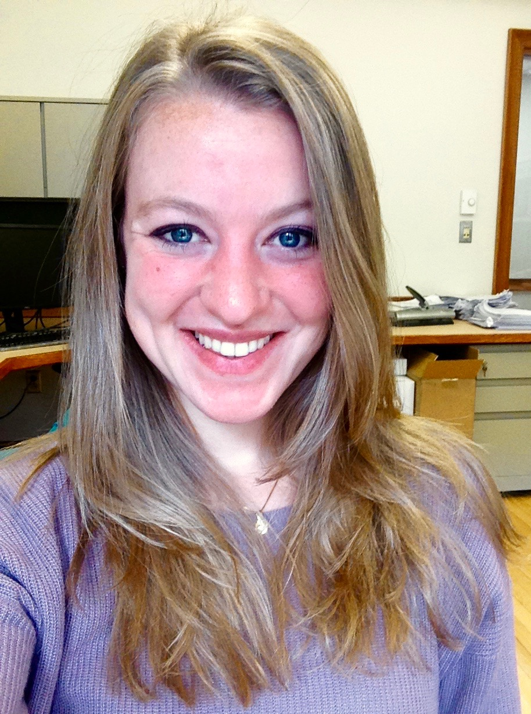

<link rel="stylesheet" href="styles.css" type="text/css">

I am a postdoctoral research fellow in the Psychiatric and Neurodevelopmental Genetics Unit at [Massachusetts General Hospital](https://www.massgeneral.org/psychiatry/research/researchlab.aspx?id=1747&display=faculty) with [Jordan Smoller](https://twitter.com/jorsmo).

I am working to detect untreated and undiagnosed patients at high risk for psychiatric illnesses and suicide to enable prevention and early intervention. I use clinical data from millions of patients' electronic health records and genetic data collected through biobanks to build accurate, generalizable models that can work in real world healthcare settings. Work at this scale is possible through collaborations with many other hospital systems across the country including Vanderbilt University Medical Center, Geisinger Health System, and Mount Sinai Health System. 

I earned my PhD from [Yale University](https://psychology.yale.edu/) in psychology in 2017. In graduate school, I worked with [Ty Cannon](https://campuspress.yale.edu/cannonlab/) to investigate how genes affect cognition and brain development in individuals at high risk for psychosis.

My full CV is available [here](files/Amanda_Zheutlin_CV_January2019.pdf).